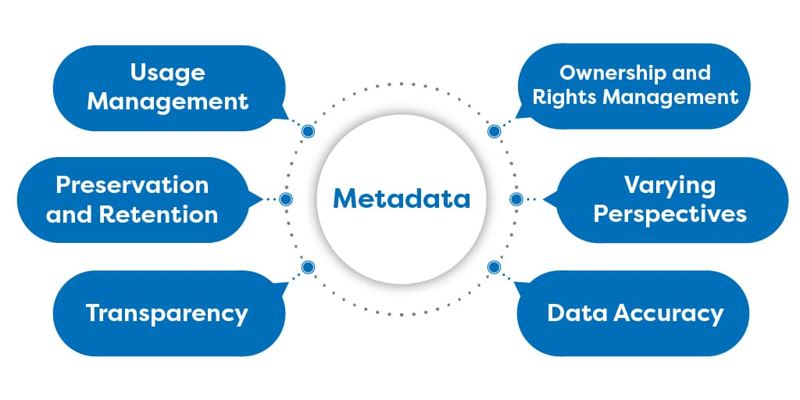

```{r setup, include=FALSE}
knitr::opts_chunk$set(echo = FALSE, warning = FALSE, message = FALSE, cache = FALSE, tidy = TRUE, tidy.opts = list(width.cutoff = 50))
library(tidyverse)
library(kableExtra)
options("kableExtra.html.bsTable" = T)
```

# Reproducibility and metadate

## What is reproducible research?

```{r, out.width== "80%"}
knitr::include_graphics("reproducible-replicable-robust-generalisable.jpg", dpi = 600)
```

* Same data, same code same results

## What is reproducible research?

```{r, message=FALSE, echo=FALSE, warning=FALSE}
if (!require("pacman")) install.packages("pacman")
pacman::p_load(ggmap, ggplot2, dplyr, readr, leaflet, dygraphs, xts, lubridate, geojsonio)
```

* Code, data (**Raw data**) and text intertwined
* in R: Rmarkdown (Rmd)
* in Python Jupiter Notebooks

```{r, echo = FALSE, out.width = "1000px"}
knitr::include_graphics("Reproducible.png")
```

## When it is not reproducible

```{r}
knitr::include_graphics("NonReproducible.gif")
```


## Reproducibility in R

```{r, echo = F, out.width='30%', fig.align='center'}
knitr::include_graphics("Rmark.png")
```

1. One folder
    + Raw data (csv, xls, html, json, images, pdf)
    + Code and text (Rmd, shiny app, md, .r)
    + Results (Manuscript, Webpage, WebApp)
    
## Some examples

* Write articles in r with [rticles](https://pkgs.rstudio.com/rticles/)
* Write your thesis in github [with Rmarkdown](https://github.com/lcreteig/thesis)
* Continuous integration [earthquakes](https://github.com/derek-corcoran-barrios/SustainscapesOrganizationPres/)
* This [presentation](https://github.com/Sustainscapes/MetadataPres)

#  Why do reproducible research?

##  Reproducible research benefits those who do it

* You can do your research again
* You can easily re-analyze when you have new input
* You can easily share it, less time teaching how to do it
* More citations, [McKiernan et al. 2016](https://elifesciences.org/articles/16800.pdf)

## Reproducible research benefits the community

* You can share your code (easier for remote sharing)

# Github

## Github

* Similar to "Google Drive" or "Dropbox" for code
* Version control (we can come back to any prior version)
* Either code based or GUIs
* Each project a repo
* Workshop next hour (Make sure you make your account for better use)

```{r, echo=FALSE}
knitr::include_graphics("Octocat.png")
```

## limitations of github

* Not great for big data
    + Limit of one file 100 Mb
    + Límite of one repo 1 Gb
* We can override that with DVC (Data Version Control)

```{r, echo = FALSE, out.width='80%', fig.asp=.75, fig.align="center"}
knitr::include_graphics("GitAdd.png")
```

## Version control

```{r}
knitr::include_graphics("VersionControl.jpg", dpi = 100)
```

# Metadata

## What is metadata

* Data about data

```{r}
knitr::include_graphics("Netflix_Metadata_structure.jpg")
```


## Why use metadata

```{r}

```

* Who "owns" the data
* Ensure citation
* Ensure data quality
* Who should I contact for clarification

## Why use metadata

* Example for papers

```{r, message = FALSE, results='hide'}
library(bibliometrix)
file <- "https://www.bibliometrix.org/datasets/savedrecs.bib"

M <- convert2df(file = file, dbsource = "isi", format = "bibtex")  
  
Table <- M %>% mutate_all(~str_wrap(.x, width = 15)) %>% as_tibble() %>% head(10)
```


```{r, message = FALSE}
kbl(Table, full.width = F) %>%
  kable_styling(c("striped", "hover", "condensed"), font_size = 7) %>%
  scroll_box(width = "800px", height = "400px")
```

* What is the data

## Why use metadata

```{r}
M <- metaTagExtraction(M, Field = "AU_CO", sep = ";")
NetMatrix <- biblioNetwork(M, analysis = "collaboration", network = "countries", sep = ";")

# Plot the network
net=networkPlot(NetMatrix, n = dim(NetMatrix)[1], Title = "Country Collaboration", type = "circle", size=TRUE, remove.multiple=FALSE,labelsize=0.7,cluster="none")
```
## What metadata standards are we going to use

* [EML](https://eml.ecoinformatics.org/) (Ecological Metadata Language, [associated r Package](https://docs.ropensci.org/EML/))
* [PRISM](https://en.wikipedia.org/wiki/Publishing_Requirements_for_Industry_Standard_Metadata)
* Species' range model metadata standards: [RMMS](https://onlinelibrary.wiley.com/doi/10.1111/geb.12993)

# Questions?

