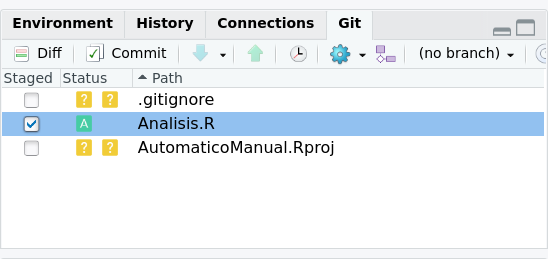

```{r setup, include=FALSE}
knitr::opts_chunk$set(echo = TRUE, warning = FALSE, message = FALSE, cache = FALSE, tidy = TRUE, tidy.opts = list(width.cutoff = 50))
library(tidyverse)
library(kableExtra)
options("kableExtra.html.bsTable" = T)
```

# Reproducibility and metadate

## What is reproducible research?

```{r, message=FALSE, echo=FALSE, warning=FALSE}
if (!require("pacman")) install.packages("pacman")
pacman::p_load(ggmap, ggplot2, dplyr, readr, leaflet, dygraphs, xts, lubridate, geojsonio)
```

* Code, data (**Raw data**) and text intertwined
* in R: Rmarkdown (Rmd)
* in Python Jupiter Notebooks

```{r, echo = FALSE, out.width = "1000px"}
knitr::include_graphics("Reproducible.png")
```

## Reproducibility in R

```{r, echo = F, out.width='30%', fig.align='center'}
knitr::include_graphics("Rmark.png")
```

1. One folder
    + Raw data (csv, xls, html, json, images, pdf)
    + Code and text (Rmd, shiny app, md, .r)
    + Results (Manuscript, Webpage, WebApp)
    
## Some examples

# Github

## Github

* Similar to "Google Drive" or "Dropbox" for code
* Version control (we can come back to any prior version)
* Either code based or GUIs
* Each project a repo
* Workshop next hour (Make sure you make your account for better use)

```{r, echo=FALSE}
knitr::include_graphics("Octocat.png")
```

## limitations of github

* Not great for big data
    + Limit of one file 100 Mb
    + Límite of one repo 1 Gb
* We can override that with DVC (Data Version Control)

```{r, echo = FALSE, out.width='80%', fig.asp=.75, fig.align="center"}

```


